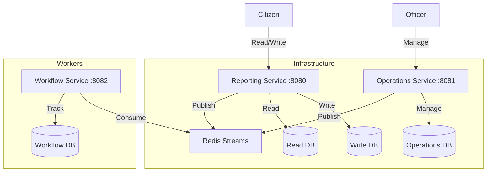

# Citizen Reporting System - PoC

A high-performance, event-driven microservices Proof-of-Concept for a citizen reporting platform. Built with **Go**, **PostgreSQL**, **Redis Streams**, and **CQRS architecture**.

## 🏗️ System Architecture

The system uses a **CQRS (Command Query Responsibility Segregation)** pattern to separate write and read operations, ensuring high read scalability for the public feed while maintaining data integrity for report creation.



## 📦 Components

| Service | Port | Database | Function |
|---------|------|----------|----------|
| **Reporting Service** | `8080` | `reporting_write_db`<br>`reporting_read_db` | Citizen API. Handles report creation (Write DB) and fetching feeds (Read DB). |
| **Operations Service** | `8081` | `operations_db` | Officer API. Manages case inbox and status updates. |
| **Workflow Service** | `8082` | `workflow_db` | Background worker. Tracks SLA compliance and notifications. |
| **Frontend** | `3000` | - | React + Vite UI for Citizens and Officers. |
| **Redis** | `6379` | - | Event Bus (Streams) for asynchronous communication. |

## 🚀 Getting Started

### Prerequisites
- Docker & Docker Compose
- Node.js & npm (for load testing)

### Run the Project
```bash
# 1. Start all services (Database, Backend, Frontend)
docker-compose up --build -d

# 2. Check logs
docker-compose logs -f
```

### Access Points
- **Frontend App**: [http://localhost:3000](http://localhost:3000)
- **Reporting API**: [http://localhost:8080](http://localhost:8080)
- **Operations API**: [http://localhost:8081](http://localhost:8081)

## � API Endpoints

### Reporting Service (Port 8080) - Citizen
| Method | Endpoint | Auth | Description |
|--------|----------|------|-------------|
| `GET` | `/health` | - | Health check |
| `POST` | `/auth/login` | - | Login, get JWT token |
| `POST` | `/reports` | Bearer | Create new report |
| `GET` | `/reports/me` | Bearer | Get my reports with status |
| `POST` | `/reports/:id/upvote` | Bearer | Upvote a public report |
| `GET` | `/reports/public` | - | View all public reports |

### Operations Service (Port 8081) - Officer
| Method | Endpoint | Auth | Description |
|--------|----------|------|-------------|
| `GET` | `/health` | - | Health check |
| `POST` | `/auth/login` | - | Login, get JWT token |
| `GET` | `/cases/inbox` | Bearer | Get inbox (filtered by agency) |
| `PATCH` | `/cases/:id/status` | Bearer | Update status (RECEIVED → IN_PROGRESS → RESOLVED) |

### Workflow Service (Port 8082)
| Method | Endpoint | Auth | Description |
|--------|----------|------|-------------|
| `GET` | `/health` | - | Health check |
| `GET` | `/notifications/me` | Bearer | Get my notifications |
| `GET` | `/sla/status` | - | View SLA status of all reports |
| `GET/POST` | `/sla/config` | - | Get/Set SLA duration |

---

## 🔄 Event Contracts

### `report.created`
```json
{
  "report_id": "uuid",
  "reporter_user_id": "citizen1",
  "visibility": "PUBLIC",
  "content": "...",
  "category": "infrastruktur",
  "created_at": "2026-01-02T20:00:00Z"
}
```

### `report.status.updated`
```json
{
  "report_id": "uuid",
  "old_status": "RECEIVED",
  "new_status": "IN_PROGRESS",
  "owner_agency": "AGENCY_INFRA",
  "changed_at": "2026-01-02T21:00:00Z"
}
```

### `report.escalated`
```json
{
  "report_id": "uuid",
  "reason": "SLA_BREACH",
  "escalation_level": 1
}
```

### `report.upvoted`
```json
{
  "report_id": "uuid",
  "voter_user_id": "citizen2",
  "created_at": "2026-01-02T20:30:00Z"
}
```

## �👤 Test Credentials

| Role | Username | Password | Agency | Function |
|------|----------|----------|--------|----------|
| **Citizen** | `citizen1` | `password` | - | Create reports, view history |
| **Officer** | `officer1` | `password` | Infrastructure | Resolve infrastructure issues |
| **Officer** | `officer2` | `password` | Health | Resolve health issues |
| **Officer** | `officer3` | `password` | Safety | Resolve safety issues |

---

## 📈 Load Test Results (k6)

We performed a stress test simulating **150 concurrent users** creating reports and updating statuses. The system demonstrated high throughput and low error rates.

**Command to Run Test:**
```bash
# 1. Reset database (Recommended)
docker-compose down -v && docker-compose up --build -d

# 2. Run k6 script
k6 run test-scripts/load-test.k6.js
```

**Latest Results (150 VUs):**

```text
     execution: local
        script: test-scripts/load-test.k6.js
        output: -

     scenarios: (100.00%) 1 scenario, 150 max VUs, 5m40s max duration
              * ramp_up: Up to 150 looping VUs for 5m30s

  Overview:
      Total Requests:  109,630
      Duration:        5m 32s
      Throughput:      329.68 req/s
      Error Rate:      0.00% (0 failed requests)

  Response Times (P95):
      Global HTTP:     139.12 ms
      Write Latency:   66.00 ms (Creating Reports)
      Read Latency:    421.00 ms (Fetching Feeds)
      Sync Latency:    61.00 ms (CQRS Sync)
```

**Analysis:**
- **Zero Errors**: The system handled ~110k requests with 0% failure rate under load.
- **Fast Writes**: Creating reports is extremely fast (66ms P95) due to the dedicated Write DB.
- **CQRS Efficiency**: Split architecture prevents heavy reads from slowing down report submission.

---

## 🔄 Event Flow (CQRS + Event Driven)

1. **Create Report**:
   - Citizen POSTs to `Reporting Service`.
   - Saved to **Write DB**.
   - `report.created` event published to Redis.
2. **Sync & Process**:
   - **Reporting Service**: Updates **Read DB** for fast querying.
   - **Operations Service**: consuming event, creates case in **Operations DB**.
   - **Workflow Service**: consuming event, starts SLA timer.
3. **Resolve**:
   - Officer updates status to `RESOLVED`.
   - `report.status.updated` event published.
   - All services update their local views (Read DB, Notifications).

## 🛠️ Tech Stack
- **Language**: Golang 1.21
- **Databases**: PostgreSQL 15, Redis 7
- **Frontend**: React, TailwindCSS, Vite
- **Testing**: k6 (Load Testing)
